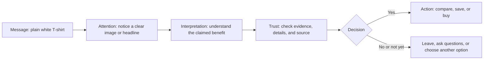

# Chapter 1: Persuasion, Attention, and Choice

Persuasion is the practice of helping shape what people notice, how they interpret it, whether they trust it, and what they decide to do next. It appears in a public-service poster, a job application, a product package, and a conversation with a friend. Used well, persuasion helps people make sense of a choice. Used badly, it can take advantage of them.

Consider a plain white T-shirt. The shirt has not changed: it is still white, short-sleeved, and made from the same material. Yet these descriptions point attention in different directions:

- **"A dependable everyday T-shirt"** emphasizes usefulness.
- **"A crisp essential for a minimal wardrobe"** emphasizes style and identity.
- **"One simple shirt, fewer clothing decisions"** emphasizes convenience.
- **"Soft organic cotton for your daily rotation"** emphasizes material and values—if the organic-cotton claim is true.

Framing does not automatically make a message dishonest. It becomes dishonest when it hides important facts, makes claims the evidence cannot support, or pressures someone past a meaningful choice.

## What Persuasion Is—and Is Not

Persuasion gives people reasons, cues, and context that may affect a decision. The person still has room to evaluate the message and choose. Coercion removes that room through threats or force. Manipulation may leave a technical choice available, but it obscures information or exploits a vulnerability so that the choice is not genuinely informed.

| Approach | How it works | Does the audience retain meaningful choice? | Plain white T-shirt example |
| --- | --- | --- | --- |
| Persuasion | Provides relevant reasons and clear framing | Yes | “This shirt is designed for a simple, everyday wardrobe; here are its fabric, fit, and price.” |
| Manipulation | Hides, distorts, or exploits | Not fully | Showing “Only 1 left!” when inventory is not actually limited, or hiding a recurring fee. |
| Coercion | Uses force, threats, or punishment | No | “Buy this shirt or lose access to something you need.” |

The boundary can sometimes be blurry. A sale deadline can be useful information when it is real and clearly stated. A fake deadline is not the same thing.

## Cialdini’s Principles of Influence

Psychologist Robert Cialdini describes several common patterns that can influence decisions. They are not magic buttons, and none of them makes an ethical obligation disappear. They are useful partly because they help explain why certain messages feel persuasive.

| Principle | Basic idea | T-shirt example | Ethical use |
| --- | --- | --- | --- |
| Reciprocity | People often want to return a benefit they received. | A brand provides a useful fit guide or fabric-care guide before asking for a purchase. | Offer real value without implying that a “gift” creates a debt. |
| Commitment and consistency | People often prefer actions that fit earlier choices and stated values. | Someone who has chosen a smaller wardrobe may consider a durable white T-shirt. | Connect to a real stated goal; do not trap people in a decision they want to revise. |
| Social proof | People look to others when deciding what is sensible or popular. | Reviews explain that customers found the shirt true to size. | Use genuine, relevant reviews; do not buy, invent, or selectively misrepresent them. |
| Liking | We are more open to people or brands we find appealing or similar to us. | A relatable student shows how they wear the shirt in several outfits. | Make the connection authentic; avoid pretending a sponsored relationship is independent. |
| Authority | People may rely on credible expertise. | A textile specialist explains why a particular knit may feel softer or last longer. | Identify qualifications and limits; expertise should match the claim. |
| Scarcity | Limited availability can make an option seem more valuable or urgent. | “This size is sold out” can matter to someone ready to buy. | State scarcity only when it is real; never create fake countdowns or stock notices. |
| Unity | People can be influenced by a sense of shared identity or belonging. | “Made for people building a practical campus wardrobe.” | Invite belonging without suggesting that nonbuyers are less worthy members of the group. |

## Two More Ideas That Help Explain Persuasion

### Framing and the reference point

The same information can feel different depending on the comparison that surrounds it. This is called **framing**. A $20 white T-shirt might be framed as “$20 for a wardrobe basic you can wear every week” or “$20 for one plain shirt.” Neither sentence changes the price. Each sets a different reference point for judging value.

Designers should make sure the frame is not doing the work of deception. If the shirt is thin, difficult to wash, or unusually short-lived, a “buy once, wear forever” frame would be misleading.

### Cognitive ease and clarity

People often trust or choose information that is easy to understand and evaluate. Clear headings, readable type, specific product details, and an obvious next step reduce unnecessary mental effort. This is sometimes described as cognitive ease.

For the T-shirt, “100% cotton, unisex fit, machine washable, 30-day returns” helps someone assess the item. Vague language such as “premium comfort” may sound attractive, but it gives the shopper less to evaluate. Clarity can persuade because it respects the reader’s attention.

## A Simple Model of How a Message Works

Persuasion is usually a sequence, not a single trick. A viewer first notices a message, interprets what it means, decides whether the source and claim are trustworthy, and then acts—or chooses not to act.

The last branch matters. Ethical design makes it possible to decline, pause, compare alternatives, or find more information. Persuasion should not treat a “no” as a design failure to be overridden.

## Ethical Cautions

Powerful messages deserve extra care when the audience has less time, information, money, or ability to resist pressure. This can include children, people in financial distress, patients, or users navigating an emergency.

Watch for these warning signs:

- A claim sounds stronger than the available evidence.
- Important costs, limits, or tradeoffs are hard to find.
- Urgency, popularity, or expertise is presented as a fact when it is not.
- The design makes accepting easy but declining confusing or exhausting.
- The message benefits the sender while imposing an unreasonable hidden cost on the audience.

An ethical T-shirt page can make the shirt appealing while still showing price, fabric, sizing, care instructions, return terms, and whether sustainability claims have support. Honest persuasion gives someone a fair chance to decide that this shirt is not for them.

## Questions a Designer Should Ask

Before trying to persuade someone, pause and ask:

1. What action am I asking for, and is it reasonable for this audience?
2. What facts does someone need to make an informed choice?
3. Which part of my message is evidence, and which part is interpretation or emotion?
4. Could the framing create a false impression even if every sentence is technically true?
5. Are claims about popularity, scarcity, authority, or sustainability verifiable?
6. Can a person decline, compare options, or change their mind without unnecessary friction?
7. Who could be harmed, excluded, or pressured by this design?

## Explore Further

If you want to research these ideas more, try searches such as:

- `Robert Cialdini principles of influence reciprocity social proof scarcity`
- `framing effect behavioral economics examples`
- `cognitive ease psychology communication design`
- `ethical persuasive design dark patterns`
- `FTC guidance advertising claims endorsements scarcity`

## What You Should Remember

Persuasion shapes attention, interpretation, trust, and action; it is different from coercion and manipulation because it preserves a meaningful choice. Cialdini’s principles, framing, and cognitive ease can help explain why messages work. A plain white T-shirt can be presented as practical, stylish, convenient, or values-driven without changing the shirt itself. The designer’s responsibility is to make those frames accurate, clear, and fair.
