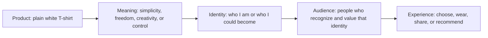

# Chapter 2: Brand Archetypes and Meaning

A **brand archetype** is a practical way to give a product, organization, or experience recognizable meaning. It draws on generalized cultural and narrative patterns: the explorer who seeks freedom, the caregiver who protects, the creator who makes something new. These patterns help an audience quickly understand what kind of role a brand wants to play in their lives.

The most useful question is not “Which label is most impressive?” It is:

> **What does the audience get to feel, imagine, or become by choosing this brand?**

A plain white T-shirt is a helpful test case. Physically, it may be the same shirt each time: the same fabric, cut, price, and care instructions. Its archetype changes the story around it. One message can make it feel like a tool for adventure; another can make it feel like a calm, dependable basic; a third can make it feel like a canvas for self-expression.

## Archetypes Are Meaning Tools, Not Personality Tests

Archetypes are not rigid categories of human personality. A person is not permanently “a Hero” or “an Innocent,” and a brand should not pretend that one word explains everyone who works there or buys from it. Instead, archetypes are shared patterns that can guide a message, visual style, voice, and customer experience.

They can also overlap. An outdoor organization might lead with the **Explorer**’s freedom while using the **Caregiver**’s concern for safety. A creative software tool might combine the **Creator**’s imagination with the **Sage**’s clarity and expertise. The primary archetype gives the audience a starting point; supporting tendencies add depth.

Cultural context matters, too. A symbol, color, joke, family role, or idea of success can mean different things in different places and communities. Before relying on an archetype, designers should learn from the people they hope to serve rather than assuming a universal reaction.

## A Useful Set of Common Archetypes

The following set is common in brand discussions. It is a vocabulary for exploring meaning, not a scientific sorting system.

| Archetype | Core promise or desire | What the audience may feel, imagine, or become | White T-shirt direction |
| --- | --- | --- | --- |
| Explorer | Freedom and discovery | Independent, open to possibility | A durable basic for packing light and going somewhere new. |
| Sage | Understanding and truth | Informed, thoughtful, capable of judging well | A clearly documented shirt with straightforward fabric and fit information. |
| Creator | Imagination and self-expression | Original, capable of making | A blank white canvas for drawing, printing, or styling in a personal way. |
| Ruler | Control and accomplishment | Polished, prepared, in command | A crisp wardrobe staple for an organized, confident look. |
| Caregiver | Support and protection | Looked after, considerate of others | A comfortable shirt presented as an easy, dependable option for everyday care. |
| Rebel | Liberation from constraints | Defiant, distinct, unwilling to follow rules | A deliberately plain shirt paired with a message rejecting flashy labels. |
| Hero | Courage and achievement | Strong, resilient, ready to meet a challenge | A hard-wearing shirt for showing up and doing difficult work. |
| Everyperson | Belonging and practicality | Included, comfortable, down-to-earth | An affordable, familiar shirt for ordinary days. |
| Innocent | Simplicity and optimism | Calm, wholesome, hopeful | A clean, uncomplicated white shirt for a fresh start. |
| Jester | Fun and spontaneity | Playful, socially connected | A basic shirt introduced with a lighthearted “wear it your way” tone. |
| Lover | Connection and beauty | Attractive, expressive, close to others | A soft, well-fitting shirt that supports a carefully chosen outfit. |
| Magician | Transformation and possibility | Changed, inspired, able to imagine more | One white shirt shown transforming from class outfit to evening look. |

## One Shirt, Dramatically Different Positions

The shirt does not need to be altered for its meaning to change. The following positions use different aspects of the same item. A responsible message still tells the truth about its material, fit, price, and limits.

| Archetype-led position | Example message | Audience experience | Design choices that could support it |
| --- | --- | --- | --- |
| Explorer | “Pack less. Go farther. This simple white T-shirt belongs wherever your next day takes you.” | The buyer imagines mobility, independence, and an open schedule. | Outdoor setting, roomy photography, travel checklist, practical care details. |
| Creator | “Start with a blank canvas.” | The buyer imagines customizing, styling, or making the shirt part of a personal project. | Sketchbook-like graphics, examples of styling, space for user-created work. |
| Everyperson | “The white T-shirt for real life.” | The buyer feels included and relieved of pressure to look exceptional. | Familiar daily scenes, clear price and sizing, warm plain language. |
| Ruler | “One sharp essential. A wardrobe that works on purpose.” | The buyer imagines control, competence, and a polished routine. | Clean grid, precise product details, structured styling suggestions. |
| Magician | “One shirt. More possibilities than you expect.” | The buyer imagines a small change producing a larger transformation. | Before-and-after outfit sequence, adaptable styling ideas, visual transitions. |

Notice the difference between a promise and a fantasy. “Works well for travel” can be supported with honest details about the shirt’s weight, care, and durability. “This shirt will make you fearless” is an emotional exaggeration. Archetypes should make a meaningful invitation, not an impossible guarantee.

## From Product to Audience Meaning

A product has features, but people rarely choose features alone. They connect those features to a meaning, then to an image of who they are or could be. Brand archetypes help designers build that connection deliberately.

For example, “plain cotton shirt” can become “a blank canvas,” which can become “I am someone who makes things my own,” which may appeal to people who value self-expression. The connection works only when the product experience supports the story. A poorly made shirt weakens a message about dependable exploration; a restrictive design weakens a message about creative freedom.

## Keeping an Archetype Practical

An archetype is most useful when it guides decisions beyond a slogan. If a brand leads with **Sage**, its product information, customer support, and claims should be precise. If it leads with **Caregiver**, its returns process and accessibility should show care rather than create stress. If it leads with **Jester**, it can be playful without making important terms hard to understand.

Concrete details keep the work honest. For the white T-shirt, say what the fabric is, how it fits, how it should be washed, and what it costs. Then let the archetype shape emphasis and mood. “A calm essential for everyday life” is clearer and more credible when shoppers can also see the measurements and return policy.

## Archetypes Are Not Destiny

A chosen archetype is a direction, not a permanent identity. Brands can change as their audience, products, or social context changes. They may use different tones for different offerings, provided the differences are understandable and do not mislead people.

Avoid using archetypes as stereotypes. “Lover” does not mean every message must be aimed at romance, and “Hero” does not require aggressive language or a narrow image of strength. A designer should not assume that a particular gender, age, culture, or income group belongs to one archetype. Listen to real audiences, test ideas respectfully, and revise when the message misses its mark.

The white T-shirt can be Explorer-led for a travel-focused campaign and Everyperson-led for a campus basics page. The garment has not acquired a new personality; the communication has chosen a different, truthful angle for a different context.

## Questions to Ask When Choosing an Archetype

1. What does the product or experience actually enable someone to do?
2. What does the audience get to feel, imagine, or become by choosing it?
3. Which archetype best clarifies that value without exaggerating it?
4. Which supporting archetype might add depth, and would it confuse the main message?
5. Does the visual style, language, service experience, and product behavior all support the same promise?
6. What cultural assumptions am I making, and who should I learn from before finalizing the work?
7. Could this framing exclude, stereotype, pressure, or mislead part of the audience?
8. What specific evidence would help the audience decide whether the promise is credible?

## What You Should Remember

Brand archetypes are generalized cultural and narrative patterns that help products and organizations become meaningful; they are not fixed personality labels. The practical question is what the audience gets to feel, imagine, or become. The same plain white T-shirt can truthfully represent exploration, creativity, everyday belonging, control, or transformation depending on its framing. Choose an archetype that fits the real experience, respects cultural context, and remains flexible as people and situations change.
