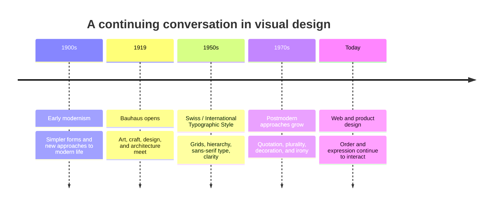

# Chapter 3: Design Language—Order, Expression, and Meaning

Visual design carries ideas before a reader finishes a sentence. A tightly aligned page can suggest competence and control. A collage of oversized type, clashing colors, and overlapping images can suggest energy, play, protest, or uncertainty. Neither approach is automatically better. Each gives people a different way to interpret what they see.

Design history is useful because it gives us names for these choices. It also prevents a common mistake: treating one visual style as the final answer to every communication problem.

## From Early Modernism to the International Style

Early modernism developed as designers, artists, and architects responded to industrial production, new materials, mass communication, and rapidly changing cities. Although early modernist movements differed from one another, many designers looked for forms that felt appropriate to a new age: simpler shapes, less historical decoration, and a closer relationship between form, material, and purpose.

The **Bauhaus**, a German school founded in 1919, became an influential site for this thinking. Its teachers and students connected art, craft, design, and architecture. Bauhaus work was not one single look, but it often explored geometry, experimentation with materials, and design for modern life. The school closed under political pressure in 1933, but its ideas traveled widely through the work of people associated with it.

Later, the **Swiss / International Typographic Style** developed especially strongly in mid-twentieth-century graphic design. It is often associated with grids, sans-serif type, asymmetric layouts, photography, visual hierarchy, and careful alignment. Its aim was often clarity: organize information so a wide audience can understand it. A grid was not merely decoration; it was a tool for making relationships visible and repeatable.

## Postmodernism Questions the Rules

By the later twentieth century, many designers questioned modernism’s confidence in certainty, restraint, universality, and order. **Postmodernism** was not a single visual recipe, but it often welcomed quotation, historical references, contradiction, ornament, humor, bright color, and multiple voices. It challenged the idea that design had to look neutral in order to be useful.

This did not mean that postmodern designers rejected function. Instead, they often asked whose idea of “function” or “universal” was being treated as normal. A highly ordered layout can make information easier to scan, but it can also communicate institutional authority. A messy-looking layout can create friction, but it may also express a specific subculture, invite interpretation, or make the viewer slow down.

## The Tensions That Continue

It is tempting to place modernism on one side and postmodernism on the other, then choose a winner. In practice, designers work with continuing tensions. A campus website may need clear navigation and also a distinct personality. A banking app may benefit from restraint, while a music event page may use abundance and disruption to create excitement.

| Tension | One design impulse | The opposing impulse | A practical question |
| --- | --- | --- | --- |
| Order and disruption | Predictable placement, alignment, and rhythm | Surprise, interruption, or visual friction | Does disruption add meaning, or only make a task harder? |
| Universality and identity | Broad legibility and shared conventions | A specific voice, community, or cultural point of view | Who needs to understand this, and whose perspective should be visible? |
| Clarity and expression | Fast scanning and direct information | Mood, emotion, and distinctive character | What must be understood immediately, and what can invite exploration? |
| Grid and anti-grid | Repeated columns and consistent spacing | Overlap, irregular placement, and broken alignment | Does breaking the grid direct attention intentionally? |
| Restraint and abundance | Limited color, type, and imagery | Layering, ornament, and many competing elements | What needs emphasis, and what is merely noise? |
| Function and irony | Literal instructions and dependable interaction | Playful contradiction, reference, or critique | Could irony confuse someone trying to complete an important task? |

These pairs are not switches with only two positions. A page can use a grid for its navigation while breaking it in a poster image. A product can have a calm, accessible checkout flow and an expressive launch campaign. Good design decides where consistency helps and where variation communicates something worth noticing.

## The Same White T-shirt, Two Design Languages

The plain white T-shirt has not changed: same fabric, fit, price, and care instructions. Its presentation can still make it feel like a different product.

| Presentation | Possible design choices | How the shirt may feel |
| --- | --- | --- |
| Modernist | White space, a strict grid, neutral sans-serif type, one precise product photograph, and clearly ordered fabric and sizing details | Essential, reliable, rational, and well made for everyday use |
| Postmodern | Layered images, expressive or mixed type, unexpected color, playful captions, and styling shown from several points of view | Individual, ironic, expressive, and open to reinterpretation |

The modernist page might use the heading “WHITE T-SHIRT” and list the garment’s facts in a clean column. The postmodern page might repeat the word “white” at different scales, add a handwritten note such as “not just basic,” and show the shirt styled in contrasting ways. Neither page should invent material claims or hide the price. The visual language changes interpretation; the product information must remain accurate.

## How to Read a Design

Reading a design means looking beyond whether you personally like it. Treat the design as an argument made through visual choices.

Start by describing what is actually there:

1. What do you notice first, second, and third? Look at scale, placement, contrast, color, image, and type.
2. What is organized by a grid, repeated system, or visual hierarchy? What appears to break that system?
3. Which details make the design feel restrained, abundant, official, playful, urgent, luxurious, or informal?
4. Who seems to be the intended audience? What evidence supports that interpretation?
5. What action does the design make easy: reading, buying, joining, sharing, comparing, or something else?
6. What cultural references, assumptions, or exclusions might be present?
7. What information is easy to find, and what information is missing or difficult to reach?

Then make an interpretation that you can support with evidence. Instead of writing, “This is modernist because it is simple,” try: “The asymmetric grid, limited typefaces, and large areas of empty space prioritize scanning and give the information an orderly, institutional tone.”

## Contemporary Web and Product Design

History did not end with one winning style. Contemporary web and product design regularly combines ideas that once seemed opposed. Design systems use grids, reusable components, and accessibility rules because users need dependable interactions. At the same time, brands use motion, custom illustrations, expressive type, unusual layouts, and changing themes to communicate identity.

For example, a student portal may use a stable navigation bar, consistent buttons, and readable forms—choices close to modernist clarity. Its homepage might still feature bold photography, a lively campaign graphic, or language rooted in campus culture. A shopping site can make search and checkout plain and predictable while using an expressive editorial page to tell a product story.

The key is context. A medical appointment form should make dates, costs, and instructions easy to understand. An exhibition website can afford more ambiguity if that ambiguity is part of the experience and does not prevent people from finding hours, access information, or tickets. Visual expression and usability are partners when each is used deliberately.

## Museum Research

Use museum and institutional collections to study actual objects rather than relying only on reposted images or anonymous design accounts. Search for an object, read its collection record, and verify the designer, date, medium, and description yourself before using it in an assignment.

Try searches such as:

- `The Metropolitan Museum of Art collection early modernist poster`
- `MoMA collection Bauhaus graphic design`
- `Cooper Hewitt collection Swiss typography poster`
- `V&A collections International Typographic Style`
- `Bauhaus archives graphic design typography`
- `museum collection postmodern graphic design poster`

You can also search another credible museum, library, university archive, or design institution. For each object you find, record the collection name, object title, designer or maker if listed, date, and the evidence you used in your interpretation. Verify that the object page is authentic and that its description actually supports your claim. Do not assume an image online is accurately labeled.

## What You Should Remember

Visual design carries ideas through choices about order, type, image, color, space, and interaction. Early modernism, the Bauhaus, and the Swiss / International Typographic Style emphasized different forms of modern clarity and organization. Postmodernism partly reacted against assumptions of certainty, restraint, universality, and order by making more room for contradiction, reference, expression, and irony. Contemporary design continues to work with these tensions. The same white T-shirt can feel rational and dependable or playful and expressive depending on its visual language, even when the shirt itself has not changed.
