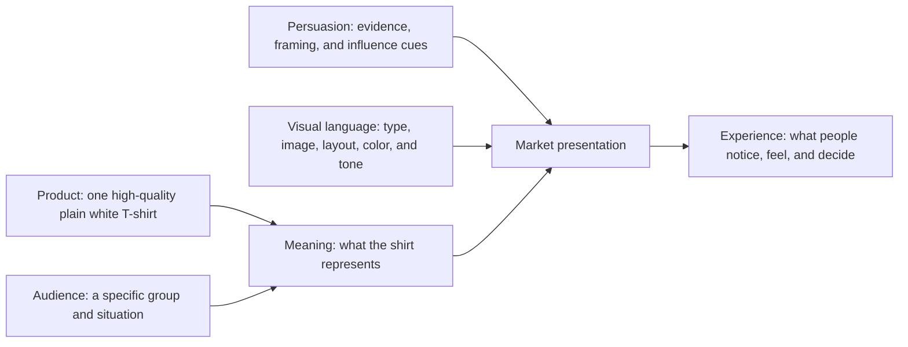

# Chapter 4: One White T-shirt, Four Entirely Different Stories

Imagine one ordinary, high-quality plain white T-shirt. It has a comfortable fit, careful construction, and clear care instructions. In this case study, its physical qualities stay substantially the same every time. No new fabric is invented. No secret feature appears between concepts. The only major change is the presentation.

That may sound like a small change, but presentation answers a much larger question: *Why should this shirt matter to me?* A product can be useful on its own. A market presentation connects that usefulness to an audience’s goals, feelings, and self-image.

## Concept 1: The Long Way Home

This concept treats the shirt as a quiet companion for people who would rather be out doing things than thinking about clothes.

| Element | Choice |
| --- | --- |
| Audience | Students, weekend travelers, and people building a small, practical wardrobe for movement between places. |
| Chosen brand archetype | **Explorer** |
| Persuasion principles being used | Commitment and consistency: connect with someone who values traveling light. Social proof: use only genuine customer notes about fit or packing if available. Scarcity: mention a size being unavailable only if it is actually unavailable. |
| Visual-design language | Open photography, lots of breathing room, a useful map-like information system, practical captions, and natural colors. The layout is organized but not overly polished. |
| Headline | **Pack less. Go farther.** |
| Short product story | This is the shirt you reach for after a late train, before an early walk, and when your bag has room for only what earns its place. It does not promise adventure; it simply avoids getting in the way of one. |
| Imagery direction | A white shirt folded beside a notebook, water bottle, and transit ticket; someone wearing it on an ordinary city walk or at a trailhead. Avoid pretending the shirt has special performance features it does not have. |
| Meaning the customer is invited to buy | Freedom, readiness, and the identity of a person who can leave with less. |
| Ethical concern or possible misuse | “Adventure” can become empty pressure or fake scarcity. Do not imply the shirt is technical gear, sustainable, or unusually durable unless those claims can be supported. |

The important move here is not “outdoorsy pictures.” It is the invitation to see simplicity as freedom. The buyer is not merely buying cotton; they are considering a version of themselves who is less tied down.

## Concept 2: The Standard

This presentation makes the shirt feel like a well-considered tool: one reliable answer to an everyday question.

| Element | Choice |
| --- | --- |
| Audience | People who prefer fewer, clearer choices and want ordinary items to work without drama. |
| Chosen brand archetype | **Sage**, with a supporting **Ruler** tendency |
| Persuasion principles being used | Authority: provide precise, relevant product facts rather than vague expertise. Cognitive ease: make sizing, fabric, care, price, and returns easy to locate. Commitment and consistency: speak to people choosing a more intentional wardrobe. |
| Visual-design language | Restrained modernist / Swiss-influenced design: a clear grid, generous white space, one or two sans-serif typefaces, an asymmetric but orderly layout, and a precise product photograph. |
| Headline | **The White T-shirt, Clearly Made.** |
| Short product story | A basic item should not demand a complicated decision. This presentation puts the information in order so the customer can judge the shirt for themselves. The confidence comes from clarity, not mystery. |
| Imagery direction | Front, side, and detail views on a neutral background; a measured fit diagram; close views of seams and fabric texture. Use accurate photography rather than dramatic retouching. |
| Meaning the customer is invited to buy | Control, discernment, and relief from unnecessary choices. |
| Ethical concern or possible misuse | A clean grid can make ordinary quality feel more expert or luxurious than it is. Do not let a sophisticated presentation substitute for facts, hide limitations, or imply certification that does not exist. |

This is the same shirt as in Concept 1, but it feels less like a travel companion and more like a correct answer. The design’s restraint says, “You do not need to be dazzled. You need enough information to decide.”

## Concept 3: Blank, But Never Basic

Here the white shirt becomes a starting point for an audience that enjoys changing, remixing, and refusing a single correct look.

| Element | Choice |
| --- | --- |
| Audience | Students and creative communities who enjoy styling, customizing, and treating everyday objects as material for self-expression. |
| Chosen brand archetype | **Creator**, with a supporting **Rebel** tendency |
| Persuasion principles being used | Liking: feature real creative voices with clear permission and attribution. Unity: invite participation in a community of makers. Social proof: show real user-made looks, not fabricated popularity. |
| Visual-design language | Disruptive, postmodern visual language: overlapping images, mixed type treatments, handwritten notes, cropped phrases, bright accent colors, and deliberately broken grid moments. |
| Headline | **Blank, But Never Basic.** |
| Short product story | The shirt starts plain on purpose. Wear it clean, alter it, print on it, layer it, photograph it, or make it part of a look nobody else would build. The product is simple; the interpretation does not have to be. |
| Imagery direction | Several people styling the same white shirt in sharply different ways; a collage of sketches, fabric close-ups, doodles, and imperfect snapshots. Do not show irreversible alterations as if they are included with the purchase. |
| Meaning the customer is invited to buy | Permission to experiment and the identity of someone who makes familiar things their own. |
| Ethical concern or possible misuse | “Rebellion” can turn into a marketing costume that exploits a subculture while ignoring its voices. The visual chaos must not hide price, care, accessibility information, or the actual appearance of the shirt. |

The postmodern energy is not an excuse for random decoration. Its job is to show that a plain object can have many meanings. If every detail is loud, however, the customer may remember the collage and forget what the shirt is actually like.

## Concept 4: The Shirt You Don’t Have to Think About

This concept moves in the opposite direction from the creative collage. It makes ordinariness feel reassuring instead of boring.

| Element | Choice |
| --- | --- |
| Audience | Busy students, caregivers, and anyone who values comfort, belonging, and a low-pressure everyday choice. |
| Chosen brand archetype | **Everyperson**, with a supporting **Caregiver** tendency |
| Persuasion principles being used | Reciprocity: offer a genuinely useful size guide or laundry guide with no hidden obligation. Liking: use familiar, respectful everyday situations. Social proof: include only verified, relevant reviews if they exist. |
| Visual-design language | Warm and accessible: readable type, soft neutral color, candid everyday images, consistent spacing, and a direct, friendly voice. It uses order without looking corporate. |
| Headline | **The Shirt You Don’t Have to Think About.** |
| Short product story | Some clothes ask for attention. This one gives attention back. It is there for a long day of class, an unexpected spill, a quick errand, and a quiet evening when comfort matters more than making a statement. |
| Imagery direction | Shared laundry room, study table, grocery run, or relaxed apartment scene; people with varied styles wearing the same shirt naturally. Do not use “relatable” images as a shortcut for stereotype. |
| Meaning the customer is invited to buy | Ease, belonging, and the comfort of being prepared for ordinary life. |
| Ethical concern or possible misuse | A message about care can become patronizing or imply that a product solves stress, loneliness, or financial strain. Keep the promise focused on the shirt and make price and terms easy to understand. |

This is not a lesser concept because it is less dramatic. For the right person, “I do not have to think about this” is a genuine benefit. Its persuasion depends on recognizing that everyday life is already full of decisions.

## Synthesis: What Changed, and What Did Not?

| Concept | Main audience feeling | Archetype | Persuasion focus | Visual language | Meaning beyond the shirt | Main ethical risk |
| --- | --- | --- | --- | --- | --- | --- |
| The Long Way Home | Freedom and readiness | Explorer | Consistency, honest social proof, real scarcity | Spacious, practical, journey-oriented | “I can travel light and stay open to what is next.” | False performance, sustainability, or urgency claims |
| The Standard | Control and confidence | Sage / Ruler | Relevant authority, cognitive ease, consistency | Restrained modernist / Swiss-influenced grid | “I make considered choices.” | Elegant presentation overstating quality or expertise |
| Blank, But Never Basic | Creative permission and distinctiveness | Creator / Rebel | Liking, unity, genuine social proof | Disruptive postmodern collage and anti-grid moments | “I make ordinary things my own.” | Exploiting a subculture or obscuring key information |
| The Shirt You Don’t Have to Think About | Comfort and belonging | Everyperson / Caregiver | Reciprocity, liking, verified social proof | Warm, legible, everyday and accessible | “I am allowed an easier ordinary day.” | Patronizing care language or hiding costs |

All four concepts sell the same physical shirt. They differ in what they ask the audience to notice, what kind of person they invite the audience to imagine, and which visual and persuasive tools they use. That is why design choices should be intentional: a headline, a grid, and a photo do not just decorate a product; together, they frame its value.

## What You Should Remember

One ordinary high-quality white T-shirt can be presented as a companion for exploration, a rational wardrobe essential, a canvas for creativity, or an easy everyday comfort. Product, audience, meaning, persuasion, and visual language combine to create the market presentation. Strong work keeps the physical product and its claims honest while making a clear invitation: not just “buy this shirt,” but “here is what this shirt can mean in your life.”
