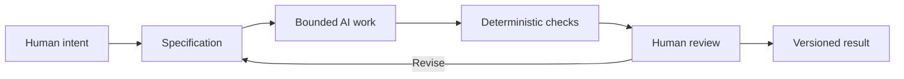

# Chapter 5: Directing AI Work with Meaning and Control

Persuasion, brand archetypes, and visual language are not only tools for advertisements. Together, they form a high-level control framework for any creative project—including work assisted by AI. They help a team decide what a project should accomplish before asking a tool to produce words, images, code, layouts, or research notes.

| Framework | The question it helps answer | In an AI-assisted project |
| --- | --- | --- |
| Persuasion | **What response are we trying to enable?** | Should a reader understand, compare, trust, sign up, learn, or take another action? |
| Archetype | **What meaning or identity are we expressing?** | Should the work feel exploratory, expert, caring, inventive, ordinary, or something else? |
| Design language | **How should that meaning look and feel?** | Should the result be restrained, playful, systematic, expressive, spacious, or dense? |

These questions prevent a vague request such as “make it good.” They turn creative direction into decisions an AI tool, a human collaborator, and a future reviewer can understand.

For example, imagine asking an AI to help create a page for the same plain white T-shirt used in earlier chapters. Persuasion might set the response: help a shopper compare fit and decide confidently. Archetype might set the meaning: the **Sage**, promising clarity and thoughtful judgment. Design language might set the form: a Swiss-influenced grid, simple type, precise product images, and obvious sizing information. The AI can generate drafts within that direction, but it should not decide on its own what the audience needs, whether claims are true, or whether the page is appropriate.

## Start with a Bounded Specification

An AI task should be bounded by a specification: a clear statement of what is being made, for whom, what belongs in the result, and what does not. A bounded task reduces accidental scope growth and makes it easier to judge whether the work is finished.

A useful specification can include:

- **Goal:** What should the audience be able to understand or do?
- **Audience and context:** Who will use it, and in what situation?
- **Required output:** Which files, sections, formats, or features must be present?
- **Constraints:** What must remain unchanged? What claims require evidence? Which sources or content are off-limits?
- **Voice and design direction:** Which archetype and visual language should guide the result?
- **Acceptance checks:** What can be tested before a human reviews the work?

“Make a landing page for a T-shirt” leaves many important decisions open. “Draft one product page for an ordinary high-quality white T-shirt, for first-year students seeking a practical basic; use an Everyperson voice, direct product facts, accessible headings, no unsupported sustainability claims, and include a sizing section” gives the AI a much safer and more useful boundary.

## A Workflow with Checks and Judgment

AI can produce a draft quickly, but speed is not the same as correctness. A strong workflow separates work that can be checked mechanically from work that needs interpretation.

The loop is important. Human review may reveal that the specification was incomplete, unclear, or based on a mistaken assumption. The right response is often to revise the direction and run the work again, not to force a flawed draft across the finish line.

## Git: Traceability and Recovery

Git records changes over time. In an AI-assisted project, that history provides **traceability**: a way to see what changed, when it changed, and what version came before it. It also supports **recovery** when a new draft introduces a mistake or moves away from the agreed direction.

For a student project, this can be as practical as checking which files changed before committing, writing a clear commit message, and keeping small, meaningful changes together. If an AI edits a heading, code example, and source note at once, Git makes that bundle visible for review. If the change is wrong, the earlier version is still part of the project history.

Git does not decide whether a change is good. It makes the decision and its consequences easier to inspect, discuss, and revise.

## Deterministic Checks: Cheap and Repeatable

A **deterministic** check gives the same result when it receives the same input. Examples include a Markdown linter reporting a malformed table, a test checking that a required function returns the expected output, a build verifying that a site compiles, or a script confirming that required files exist.

These checks are useful because they are cheap and repeatable. Run them every time a draft changes, and they can catch predictable mistakes before a person spends time on a deeper review. They are especially good at answering questions like:

- Does the file exist at the required path?
- Does the program build or test successfully?
- Are required headings, fields, or links present?
- Does the output match a known format?

They cannot tell you whether a joke is appropriate, a visual identity is respectful, a product claim is truthful, or an explanation will make sense to a worried first-year student. A passing check means “this rule passed,” not “this work is finished.”

## AI Review: Helpful, but Probabilistic

AI can review a draft for missing requirements, unclear language, inconsistent tone, possible edge cases, or patterns a person may have overlooked. This is useful as another perspective, particularly for a long checklist or an early draft.

But AI review is **probabilistic**: it may give different feedback on different runs, miss a problem, or confidently identify a problem that is not really there. It should be treated as a prompt for investigation, not as proof. If an AI reviewer says a white T-shirt page makes an unsupported claim, a human should look at the actual wording and the available evidence before changing it.

The same rule applies when AI generates the work and when AI reviews it. Output can be helpful, but it is not self-validating.

## The Pit-Stop Principle

Think of an AI-assisted workflow like a race-car pit stop. Automation can keep the project moving: generating a draft, formatting a file, running checks, or comparing versions. Yet selected moments deserve deliberate human inspection. A pit crew does not assume that because the car is moving quickly, every part is safe to ignore.

Pause for human review when the work:

- makes a factual claim or summarizes evidence;
- affects a real person’s access, money, privacy, safety, or opportunity;
- establishes a public-facing voice, image, or cultural reference;
- makes a major architectural or product decision;
- passes automated checks but still feels confusing, misleading, or out of context.

The goal is not to inspect every comma with the same intensity. It is to choose the moments where judgment matters most and give them enough attention.

## Human Responsibility Does Not Disappear

AI can assist with production and review, but humans remain responsible for judgment, meaning, truthfulness, context, and final decisions. A human team decides whether the intended response is fair, whether an archetype fits the audience, whether visual language clarifies or excludes, and whether the result says something true.

Return to the white T-shirt. An AI can suggest ten headlines, arrange a product table, or generate a draft style guide. A human still needs to decide whether “Built for every adventure” overstates an ordinary shirt, whether the images represent people respectfully, whether the price is clear, and whether the final page helps someone make an informed choice.

The framework keeps those responsibilities visible:

- Persuasion sets the response the work should enable.
- Archetype sets the meaning and identity the work expresses.
- Design language makes that meaning visible and usable.
- Specifications, Git, checks, AI review, and human review keep the process bounded, inspectable, and accountable.

## Questions for Next Week

1. What response do you want to enable in your next project, and how will you know whether the work supports it?
2. Which archetype or combination of tendencies best fits the project’s real value?
3. Which visual choices will make that meaning clear without overwhelming usability?
4. What belongs in the specification before you ask an AI for help?
5. Which requirements can deterministic checks verify, and which require human judgment?
6. Where are the pit-stop moments when your team should slow down and inspect the work deliberately?
7. If an AI suggestion sounds confident, what evidence or context would you need before accepting it?

## What You Should Remember

Persuasion, archetype, and design language provide direction for AI-assisted creative and technical work: response, meaning, and form. A bounded specification keeps the task clear. Git provides traceability and recovery. Deterministic checks offer cheap, repeatable validation, while AI review can help but remains probabilistic. Automation can keep moving, but human pit stops protect the work where truth, context, judgment, and final responsibility matter most.
